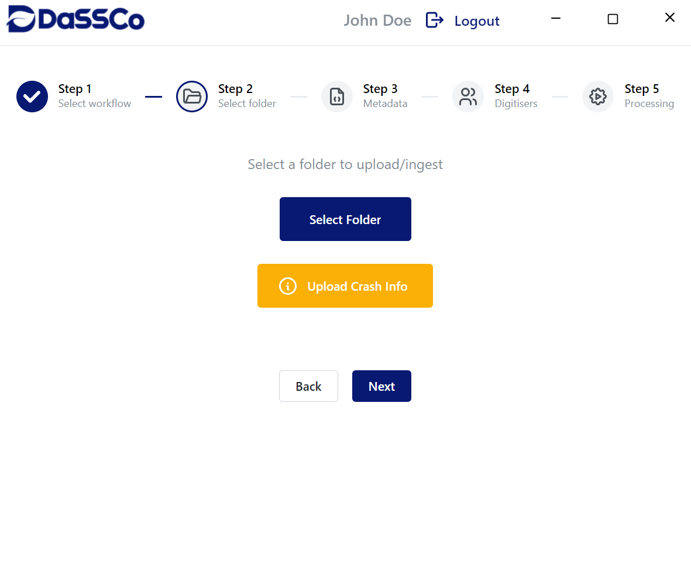
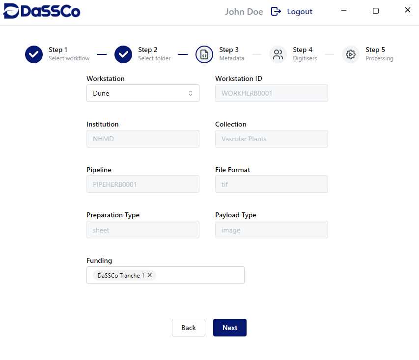
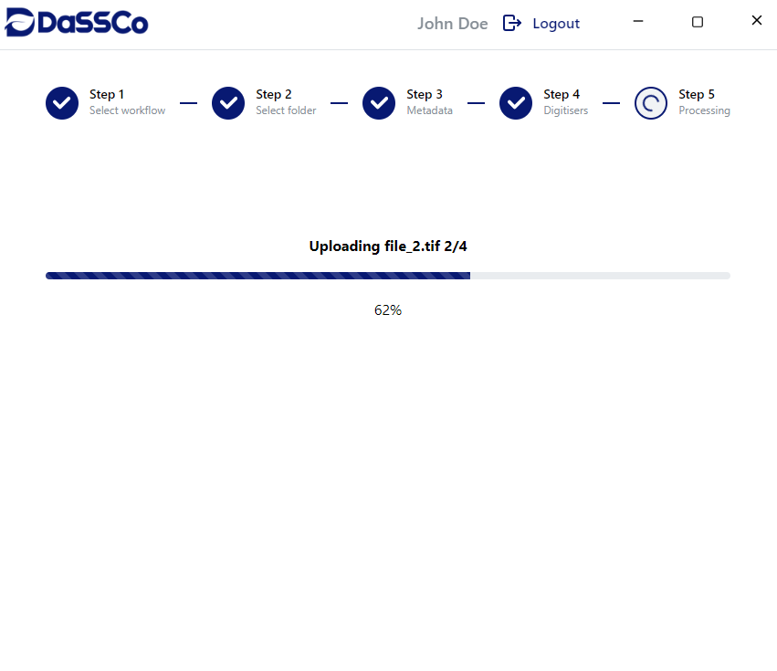

# DaSSCo Ingestion Client

The DaSSCo Ingestion Client is a desktop application that enables digitisers 
to upload large file folders and reliably ingest them into the 
DaSSCo digitisation infrastructure.

It guides the user through a sequence of steps for choosing a workflow, entering metadata, selecting a folder, and uploading files.

<table>
<tr>
<td align="center">
  <br>
  <sub><b>Select Folder</b></sub>
</td>
<td align="center">
  <br>
  <sub><b>Enter Metadata</b></sub>
</td>
<td align="center">
  <br>
  <sub><b>Upload Progress</b></sub>
</td>
</tr>
</table>

## Features
* Secure login via [Keycloak](https://www.keycloak.org/)
* Folder-based uploads
* Metadata selection to associate information with all files in a folder
* Resumable file uploads using the [tusd](https://tus.github.io/tusd/) protocol
* Integration with the DaSSCo Ingestion API
* Automatic retry mechanisms (e.g., checksum mismatches)
* Support for multiple ingestion workflows

## Installation

The latest version of the ingestion client can be found and installed from the [Releases](https://github.com/NHMDenmark/DaSSCo-Ingestion-Client/releases) page. It is currently supported only on Windows and macOS.


## Development

### Prerequisites
To run the ingestion client for development, you need:
- Node.js v24
- Git

---
Clone the repository:
```bash
git clone https://github.com/NHMDenmark/DaSSCo-Ingestion-Client.git
```

Navigate to the project directory:
```bash
cd DaSSCo-Ingestion-Client
```

Install the dependencies:
```bash
npm install
```

### Configure the environment
```bash
cp .env.example .env
```
Fill the required variables:

| Variable                       | Description                                    |
|--------------------------------|------------------------------------------------|
| VITE_KEYCLOAK_URL | Base URL of the Keycloak server (e.g. `https://biovault.dassco.dk/keycloak`) |
| VITE_KEYCLOAK_REALM                       | Keycloak realm name (e.g.  `dassco`) |
| VITE_KEYCLOAK_CLIENT_ID                   | Keycloak client ID used by the ingestion system |
| VITE_BACKEND_URL                 | Base URL of the ingestion API (e.g. `https://biovault.dassco.dk/ingestion`) |
| VITE_KEYCLOAK_ADMIN_CLIENT_ID                 | Keycloak client ID with admin permissions |
| VITE_KEYCLOAK_ADMIN_CLIENT_SECRET                 | Secret associated with the admin client ID |
| VITE_KEYCLOAK_GROUP_ID               | ID of the digitiser group (used to display digitiser lists) |
| MAIN_VITE_TUS_ENDPOINT              | tusd upload endpoint URL (e.g. `https://biovault.dassco.dk/files`)|

### Run and bundle
Run the client in development mode:
```bash
npm run dev
```
Preview a production build:
```bash
npm run start
```

Build a production-ready package:
```bash
npm run build:win # Windows
npm run build:mac # macOS
npm run build:linux # Linux
```

# License
This project is licensed under the [MIT](./LICENSE) license.
